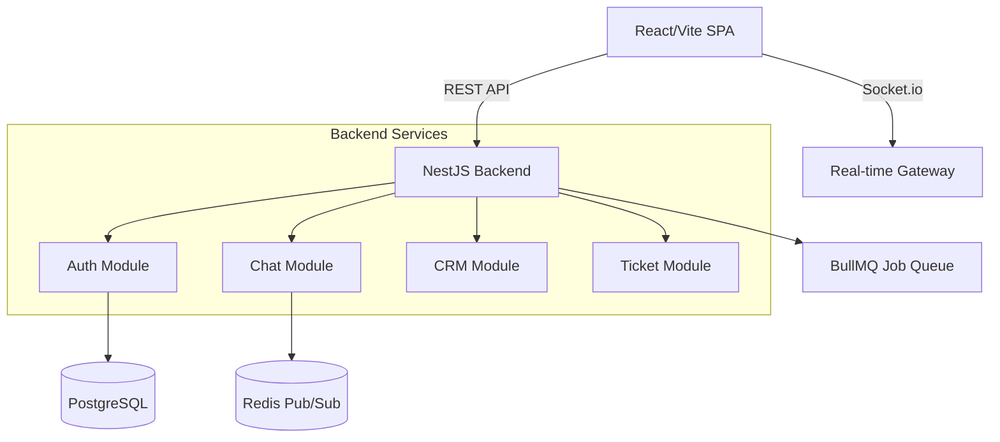

# System Architecture 🏛️

Mero Jugx uses a **Modular Monolith** architecture on the backend and a **Single Page Application (SPA)** on the frontend.

## 1. High-Level Design

## 2. Directory Structure

### Backend (`/api`)
The backend is a flat modular structure in `src`.

*   **Logic Modules**:
    *   `auth/`: JWT strategies, Login, Register.
    *   `chat/` & `admin-chat/`: Socket.io gateways and message services.
    *   `tickets/`: Issue tracking logic.
    *   `billing/` & `invoices/`: Finance logic.
*   **Centralized Database**:
    *   `database/entities/`: **All** 50+ TypeORM entities reside here (e.g., `chats.entity.ts`, `invoices.entity.ts`). This is a key design choice to avoid circular dependencies.
    *   `database/migrations/`: Database schema versioning.

### Frontend (`/app`)
A modern React SPA wired with Vite.

*   **`src/pages/`**: Application routes.
    *   `chat/`: Chat interface.
    *   `tickets/`: Support dashboard.
    *   `dashboard/`: Main analytics view.
*   **`src/store/`**: Global state management (Zustand).
*   **`src/services/`**: API clients (Axios) to talk to NestJS.

## 3. Key Patterns

### Real-Time Communication
We use **Socket.io** namespaces for real-time features:
*   `/chat`: For team messaging.
*   `/notifications`: For pushing alerts to users.

### Marketplace Architecture (`apps/`)
The system is designed to be extensible. Core features (CRM, Inventory) are treated as "Apps" that can be enabled/disabled per organization.
*   See `api/src/apps/` and `organization_apps.entity.ts`.

### Security
*   **Guards**: `JwtAuthGuard`, `RolesGuard`, `PermissionsGuard`.
*   **Interceptors**: `SentryInterceptor` for error tracking.
*   **Pipes**: Validation via `class-validator` DTOs.
