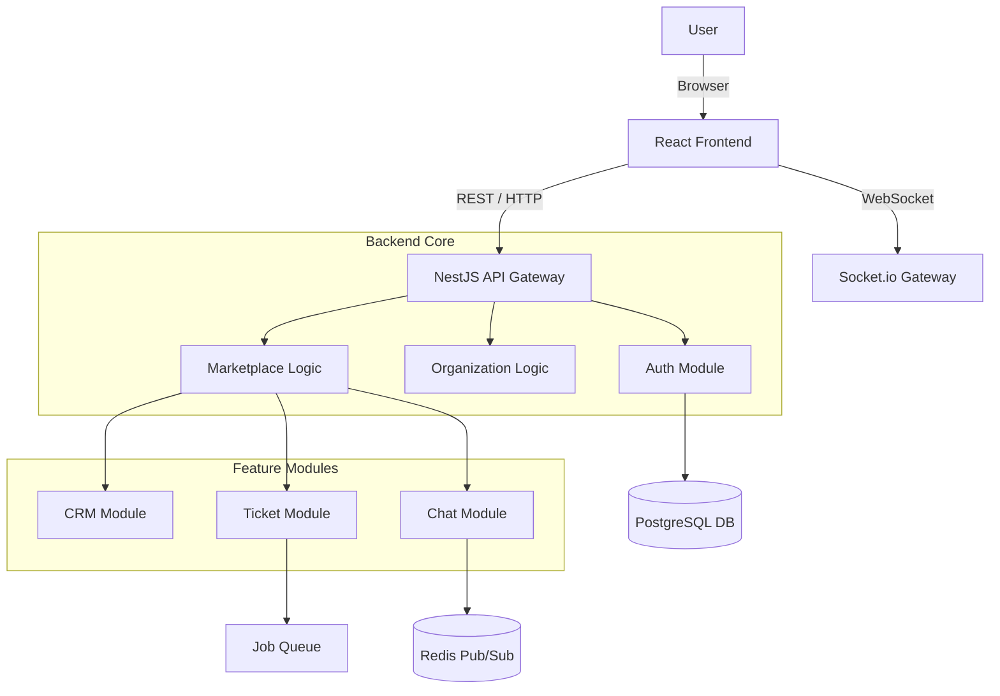

# System Architecture 🏛️

Mero Jugx is built as a **Modular Monolith** using NestJS (Backend) and React/Vite (Frontend). This architecture provides the development speed of a monolith while maintaining the strict boundaries required for complex enterprise software.

## 1. High-Level Diagram

## 2. Backend Architecture (`/api`)

### Modular Design
Modules are organized by Business Domain in `src/`.
*   **Domain Modules**: `auth`, `users`, `organizations`, `billing`.
*   **Feature Modules**: `chat`, `tickets`, `crm_*` (implied in entities), `invoices`.
*   **Infrastructure Modules**: `database`, `common` (Filters, Guards, Interceptors).

### Centralized Data Layer
Unlike Microservices where each service owns its DB, we use a **Shared Database** pattern to maximize data integrity for complex relations (e.g., Joining `Users` -> `Tickets` -> `Chats`).
*   All entities reside in `src/database/entities`.
*   This avoids circular dependencies between modules sharing common types.

### Event-Driven Communication
Modules communicate asynchronously for side effects.
*   Example: When a `User` is created -> Emit `UserCreatedEvent` -> `NotificationsModule` sends Welcome Email.

## 3. Frontend Architecture (`/app`)

### Component Structure
*   **`pages/`**: Top-level route components.
*   **`components/`**: Atomic UI elements (Buttons, Inputs) built with Radix UI + Tailwind.
*   **`services/`**: API adapters (Axios) mimicking the backend module structure.

### State Management
*   **Server State**: React Query (TanStack Query) for caching API responses.
*   **Client State**: Zustand for session/UI state (e.g., Sidebar open/close).

## 4. Security Architecture

### Authentication
*   **Strategy**: JSON Web Tokens (JWT).
*   **Tokens**:
    *   `AccessToken` (15m validity, holds `userId`, `orgId`, `roles`).
    *   `RefreshToken` (7d validity, Database backed).
*   **MFA**: TOTP-based 2FA enforced for Admin roles.

### Authorization (RBAC)
*   **Roles**: `Owner`, `Admin`, `Member`, `Guest`.
*   **Permissions**: Fine-grained scopes (e.g., `tickets:read`, `tickets:write`, `settings:manage`).
*   **Guard**: `PermissionsGuard` checks `@RequirePermission('tickets:write')` decorator.

## 5. Scalability Strategy

1.  **Horizontal Scale**: The API is stateless. We can spin up 10x `mero-jugx-backend` containers behind a Load Balancer.
2.  **Caching**: Redis caches expensive queries (e.g., Organization Settings).
3.  **Job Offloading**: Heavy tasks (PDF Invoice generation, Email blasts) are pushed to **BullMQ** to prevent Main Thread blocking.
