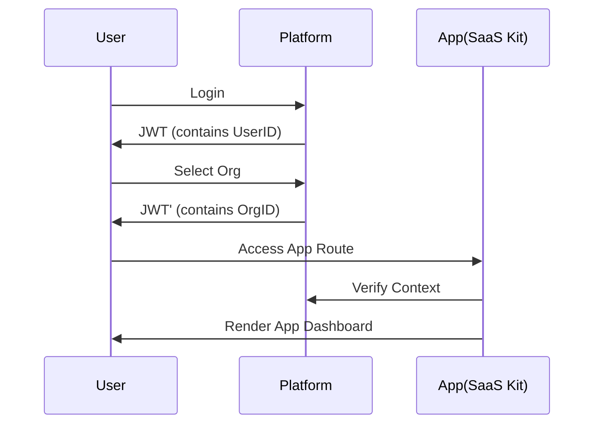

# Mero SaaS Kit Architecture

## Vision

The **Mero SaaS Kit** acts as the blueprint for all "Apps" in the Mero Jugx ecosystem. It defines the standard contract between an App and the Platform.

## The App Contract

For an application to function within Mero Jugx, it must adhere to the following architectural principles:

### 1. Directory Structure
Every app must follow this strict layout:
```
apps/<app-name>/
├── backend/     # NestJS Module
├── frontend/    # React/Vite Project
└── shared/      # App-specific Types
```

### 2. Multi-Tenancy Compliance
- **Database**: All entities must include `organization_id`.
- **API**: Endpoints must respect the `X-Organization-Id` context (usually via JWT).
- **Frontend**: Pages must be routed under `/org/:slug/apps/<app-name>`.

### 3. Shared Dependencies
Apps should minimize unique dependencies. They **must** consume:
- `@shared/frontend` for UI components.
- `@shared/backend` for utilities and guards.
- Platform Auth (no separate login systems allowed).

## Integration Flow



## Future Roadmap

- **CLI Generator**: `npm run generate:app <name>`
- **Hot-Pluggable Modules**: Ability to load apps dynamically without full platform rebuilds.
